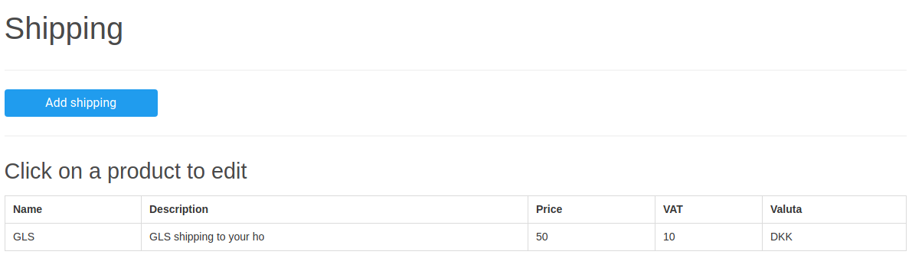

# Nim Website Creator - Basket
[Nim Website Creator](https://github.com/ThomasTJdev/nim_websitecreator) plugin to enable an ecommerce webshop, where user can buy products and get a receipt.

## Requirement
This is a plugin for [Nim Website Creator](https://github.com/ThomasTJdev/nim_websitecreator) and can not be compiled individually.

### Dependencies

* [nimPdf](https://github.com/jangko/nimpdf) - `nimble install nimpdf`
* [mime](https://github.com/enthus1ast/nimMime) - Clone the repo and run `nimble install`


## TODO
* Credit note
* Full translation of nimf-files
* API integration to payment solutions


## Changelog
### v0.9
* Changed prices from int to float
* Redesign checkout - better overview and include valuta

### v0.8
* More translations.
* Do not allow change an order, which has been cancelled (e.g. reactive it).
* Implement quantity for each product. Check for item in stock.
* Reduce stock when buying, increase stock when cancelling an order.
* Implement weight for products.
* Base shipping criteria on product weight.
```sql
ALTER TABLE basket_products ADD COLUMN quantity INTEGER;
ALTER TABLE basket_products ADD COLUMN weight INTEGER;
ALTER TABLE basket_shipping ADD COLUMN maxWeight INTEGER;
ALTER TABLE basket_shipping ADD COLUMN minWeight INTEGER;
```


### v0.7
* Allow spaces in phone number
* When changing settings in account return to accounting after changes
* Implement a sub table for products, so the purchase references the bought products for better history.
```sql
ALTER TABLE basket_purchase ADD COLUMN shippingPrice VARCHAR(100);
ALTER TABLE basket_purchase ADD COLUMN shippingVat VARCHAR(100);
```
* Set a min and max items on shipping products.
```sql
ALTER TABLE basket_shipping ADD COLUMN maxItems INTEGER;
ALTER TABLE basket_shipping ADD COLUMN minItems INTEGER;
```

### v0.6
* Fix bug with parseInt(), when mixing single and multple product buy
* Correct filename when user downloads receipt
* Fix CSS bug with width
* PDF receipt - use smaller font
* Add company ID field (optional)
```sql
ALTER TABLE basket_purchase ADD COLUMN companyid VARCHAR(300);
```


### v0.5
* Create receipts for private products
* Allow for buying multiple products (`/basket/buynow/multiple?products=1,2`)

```sql
ALTER TABLE basket_purchase ADD COLUMN multiple_product_count VARCHAR(100);
```


### v0.4
* Remove cutoff of description of products and shipping.
* Send an email to the admin, when product is bought (activate in settings)
```
ALTER TABLE basket_settings ADD COLUMN mailAdminBought VARCHAR(10);
```
* Deactivate/activate a product
```
ALTER TABLE basket_products ADD COLUMN active INTEGER;
```
* New DB column to store custom shipping details (disabled by default in css `.wipshippingdetails`)
```
ALTER TABLE basket_purchase ADD COLUMN shippingDetails VARCHAR(1000);
```

### v0.3
* Minor design
* Full JS translation
* Setting page for translations

### v0.2
* New DB columns:
```
ALTER TABLE basket_settings ADD COLUMN languages TEXT;
ALTER TABLE basket_settings ADD COLUMN language VARCHAR(10);
ALTER TABLE basket_settings ADD COLUMN translation TEXT;
```
* Support for translations

## Features

### Admin

* Create multiple products with specific prices and vats
* Create multiple shipping options
* Keep track and update status on payments, awaiting payments, shipped orders etc. (manually)
* Set company data in one place
* Enable mails to customer on order and shipping
* Make a buying conditions page
* Full translation - use your own language, customize all language variables from the browser

### Customer

* Buy products with an online form. Choose number of products and shipping method.
* Make profile where all receipts can be accessed
* Download PDF receipts
* Access old receipts
* Receive mail on placing order and when order is shipped

## Start

1) Open the main settings and specify your company data
2) Add a product
3) Add a shipping method
4) Launch

If you prefer another language than Danish or English:
1) Add you language in the language settings
2) Edit the JS file to include your language
3) Make a PR or issue containing your language, so the repo can be updated :)

## Use

* Plugin settings `/basket/settings`
* Access all the products on `/basket/products`
* Buy a single product with `/basket/products/@identifier`. You can design your own product page, and just insert links to the products.

## Todo

* Let user add multiple products to basket.
* Clear up proc names - it's mixed with buy and basket.

# Screenshots

**Stats**


___

**Products**


___

**Shipping**



___

**Accounting 1**


___

**Accounting 2**

